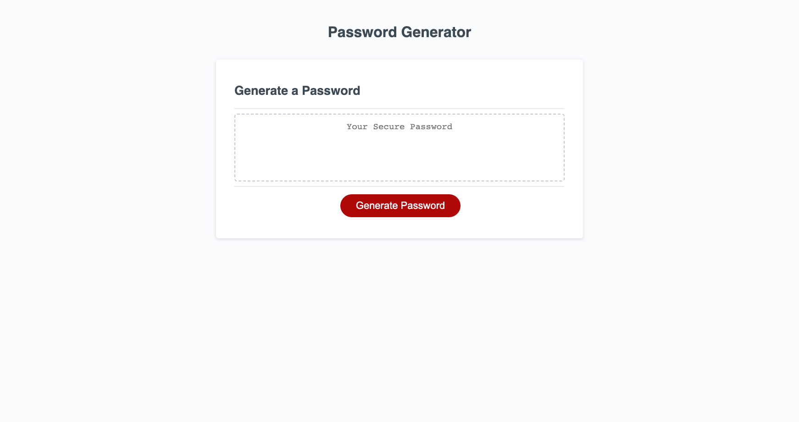

# Joshua-Password-Generator

## Description

My motivation for the project was that I wanted to prove to myself that I could successfully implement JavaScript into the project I've made, so I built a project that had it's script added upon so that it can perform the function. However I don't fully understand how to implement the scripts that the challenge is asking me to do. Since I can't fully implement the scripts I will come back and revise the password generator on a later date when I have a much better understanding of this part of Javascript.

## Usage

The screenshot of the webpage is below. It has the same look as the webpage from the Index.HTML file from the third module challenge folder in the class repo. However script has been added to the provided set of code to show a random password when the Generate a Password button is pressed:

    
    
    

## Credits

Links of Web Help:
- [Password Generator Video](https://www.youtube.com/watch?v=ssYo9t37pE4)

## License

No license used for this project